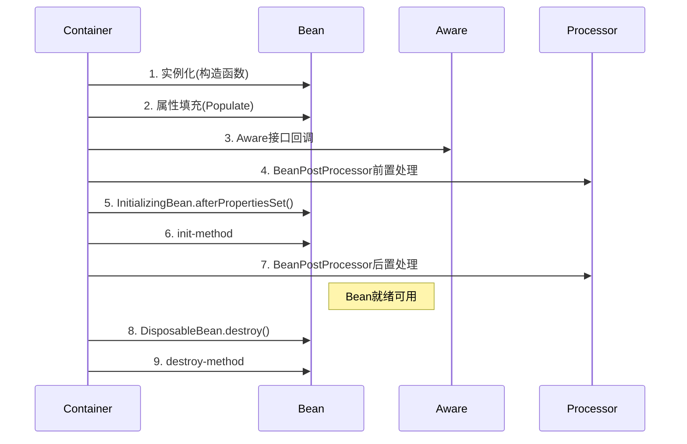

技术点

l 熟悉Java编程基础知识，包括集合、线程、IO等

l 了解Java并发编程，包括java的各种锁机制、线程池机制、AQS、CAS、ThreadLocal等

l 熟悉JVM，包括内存模型、类加载机制、常见GC算法、垃圾回收器等

l 熟悉MySQL数据库，包括一些基本原理MVCC、事务及隔离级别、索引等

l 熟练使用Spring、SpringBoot、SpringMVC、MyBatis框架，了解IOC、AOP、自动装配、SpringMVC的执行流程等

l 熟悉Redis，包括数据持久化机制、淘汰策略、过期策略、集群模式等

l 了解RabbitMQ，kafka，包括架构模式、路由规则等

l 了解Docker，Jenkins，k8s 相关服务部署应用，了解CI/CD流程，了解Prometheus及Grafana

l 了解Nginx，包括基本功能、负载均衡策略等

l 了解Linux系统以及常用命令

l 了解AIGC、AI Agent、RAG、NER等相关人工智能技术

## AQS

**AQS（AbstractQueuedSynchronizer）** 是 Java 并发编程的核心框架，位于 `java.util.concurrent.locks` 包下。它提供了一套通用的同步机制，用于构建锁（如 `ReentrantLock`）和其他同步工具（如 `Semaphore`、`CountDownLatch`）。AQS 的核心思想是通过 **状态管理** 和 **线程队列** 来实现高效的线程同步。

### **1. AQS 的核心设计**

AQS 的核心设计围绕以下两个部分展开：

**1.1 同步状态（`state`）**

- **`state`** 是一个 `volatile int` 变量，表示同步状态（如锁的持有次数、信号量的许可数等）。
- 通过 **CAS（Compare-And-Swap）** 操作来保证原子性修改：
  - `getState()`：获取当前状态。
  - `setState(int newState)`：直接设置状态（无 CAS）。
  - `compareAndSetState(int expect, int update)`：CAS 方式更新状态。

**1.2 线程等待队列（CLH 队列）**

- AQS 使用 **双向链表（CLH 变种）** 管理等待线程，每个节点（`Node`）代表一个线程。
- **队列结构**：
  - `head`：指向队列头部（不存储线程，仅作为哨兵节点）。
  - `tail`：指向队列尾部。
  - `Node` 包含：
    - `Thread thread`：等待的线程。
    - `Node prev` 和 `Node next`：前驱和后继节点。
    - `int waitStatus`：表示线程状态（如 `CANCELLED`、`SIGNAL`、`CONDITION` 等）。

---

### **2. AQS 的两种模式**

AQS 支持两种同步模式：

**2.1 独占模式（Exclusive）**

- **同一时刻只有一个线程能获取资源**（如 `ReentrantLock`）。
- **核心方法**：
  - `acquire(int arg)`：尝试获取资源，失败则进入队列阻塞。
  - `release(int arg)`：释放资源，并唤醒后续线程。

**2.2 共享模式（Shared）**

- **多个线程可以同时获取资源**（如 `Semaphore`、`CountDownLatch`）。
- **核心方法**：
  - `acquireShared(int arg)`：尝试获取共享资源。
  - `releaseShared(int arg)`：释放共享资源，并唤醒等待线程。

---

### **3. AQS 的核心方法**

AQS 是 **模板方法模式** 的实现，子类需要重写以下方法：

| 方法名                      | 作用                     | 适用模式 |
| --------------------------- | ------------------------ | -------- |
| `tryAcquire(int arg)`       | 尝试获取独占资源         | 独占     |
| `tryRelease(int arg)`       | 尝试释放独占资源         | 独占     |
| `tryAcquireShared(int arg)` | 尝试获取共享资源         | 共享     |
| `tryReleaseShared(int arg)` | 尝试释放共享资源         | 共享     |
| `isHeldExclusively()`       | 判断当前线程是否独占资源 | 独占     |

---

### **4. AQS 的工作流程（以独占模式为例）**

**4.1 获取资源（`acquire`）**

1. 线程调用 `acquire(1)`。
2. `tryAcquire(1)` 尝试获取资源：
   - 成功（`state` 修改成功）：直接返回，线程继续执行。
   - 失败：进入队列并阻塞（`addWaiter(Node.EXCLUSIVE)`）。
3. 如果线程在队列中，会不断尝试获取资源，失败则挂起（`LockSupport.park()`）。

**4.2 释放资源（`release`）**

1. 线程调用 `release(1)`。
2. `tryRelease(1)` 尝试释放资源：
   - 成功（`state` 恢复）：唤醒队列中的下一个线程（`unparkSuccessor(Node node)`）。
   - 失败：抛出异常。

---

### **5. AQS 的应用**

AQS 是 Java 并发包的核心，许多同步工具都基于它实现：

| 同步工具                 | 实现方式                                   |
| ------------------------ | ------------------------------------------ |
| `ReentrantLock`          | 独占模式，`state` 记录重入次数             |
| `Semaphore`              | 共享模式，`state` 表示剩余许可数           |
| `CountDownLatch`         | 共享模式，`state` 表示计数器               |
| `ReentrantReadWriteLock` | 拆分 `state`（高 16 位读锁，低 16 位写锁） |
| `CyclicBarrier`          | 结合 `Condition` 和 AQS 实现               |

---

### **6. AQS 的底层实现细节**

**6.1 自旋优化**

- 在入队前，线程会短暂自旋尝试获取锁，避免直接进入队列（减少上下文切换）。

**6.2 公平锁 vs 非公平锁**

- **公平锁**：严格按照队列顺序获取锁（`hasQueuedPredecessors()` 检查是否有前驱节点）。
- **非公平锁**：新线程可以直接插队尝试获取锁（`ReentrantLock` 默认非公平）。

**6.3 `Condition` 支持**

- AQS 通过 `ConditionObject` 实现 `await()` / `signal()` 机制（类似 `Object.wait()` / `notify()`）。
- `Condition` 内部维护一个 **条件队列**，与 AQS 主队列交互。

---

### **7. 自定义 AQS 实现（示例）**

```java
class MyLock extends AbstractQueuedSynchronizer {
    @Override
    protected boolean tryAcquire(int arg) {
        if (compareAndSetState(0, 1)) { // CAS 尝试获取锁
            setExclusiveOwnerThread(Thread.currentThread());
            return true;
        }
        return false;
    }

    @Override
    protected boolean tryRelease(int arg) {
        if (getState() == 0) throw new IllegalMonitorStateException();
        setExclusiveOwnerThread(null);
        setState(0); // 释放锁
        return true;
    }

    public void lock() { acquire(1); }
    public void unlock() { release(1); }
}
```

---

### **8. 总结**

- **AQS 是 Java 并发包的基石**，通过 `state` 和 **CLH 队列** 实现高效同步。
- **支持独占和共享模式**，适用于各种同步场景。
- **模板方法设计**，子类只需实现少量方法即可自定义同步工具。
- **广泛应用**：`ReentrantLock`、`Semaphore`、`CountDownLatch` 等都基于 AQS。

理解 AQS 是掌握 Java 并发的关键，它不仅是面试高频考点，也是高性能同步工具的核心实现机制。


## redis

Redis 是一个支持nosql（非结构化），key-value数据类型（结构化）、内存、缓存、分布式的、可持久化、非关系型数据库。 功能：==缓存、计数器、排行榜、消息队列、分布式锁== 


1.  完全**基于内存操作**，省去磁盘I/O的消耗
2.  命令执行使⽤**单线程**，避免了线程切换和竞态产生的消耗
3.  基于**⾮阻塞的IO多路复⽤**机制（epoll）
4.  **C语⾔**实现，优化过的数据结构，基于⼏种基础的数据结构，redis做了⼤量的优化，性能极⾼（例如sds简单动态字符串，虚拟内存技术）
5.  kv存储，**跳表**（二分查找，以空间换时间，提高查找效率）


string类型：int（8字节长整型）/embstr（小于等于39字节字符串）/raw（大于39个字节字符串），二进制安全，sds简单动态字符串


什么是I/O多路复用？

- I/O ：网络 I/O
- 多路 ：多个网络连接
- 复用：复用同一个线程。
- IO多路复用其实就是一种同步IO模型，它实现了一个线程可以监视多个文件句柄；一旦某个文件句柄就绪，就能够通知应用程序进行相应的读写操作；而没有文件句柄就绪时,就会阻塞应用程序，交出cpu。


**Redis的虚拟内存机制是啥呢？**

> 虚拟内存机制就是暂时把不经常访问的数据(冷数据)从内存交换到磁盘中，从而腾出宝贵的内存空间用于其它需要访问的数据(热数据)。通过VM功能可以实现冷热数据分离，使热数据仍在内存中、冷数据保存到磁盘。这样就可以避免因为内存不足而造成访问速度下降的问题。


### 过期策略

1.   ==定期删除==，redis默认是==每100ms就随机抽取==一些设置了过期时间的key，并检查其是否过期，如果过期就删除。因此该删除策略并不会删除所有的过期key。 

2.   ==惰性删除==，在客户端==需要获取某个key时==，redis将首先进行检查，若该key设置了过期时间并已经过期就会删除。


### 淘汰策略

redis内存有限，满了会执行淘汰策略：

1.noeviction(默认策略)：对于写请求不再提供服务，直接返回错误（DEL请求和部分特殊请求除外）

2.allkeys-lru：从所有key中使用LRU算法进行淘汰（==LRU算法：即最近最少使用淘汰算法，侧重访问时间==）

3.volatile-lru：从设置了过期时间的key中使用LRU算法进行淘汰

4.allkeys-random：从所有key中随机淘汰数据

5.volatile-random：从设置了过期时间的key中随机淘汰

6.volatile-ttl：在设置了过期时间的key中，==淘汰过期时间剩余最短的==

7.volatile-lfu：4.0版本新增，当内存不足以容纳新写入数据时，在过期的key中，使用LFU算法（==LFU算法：最不经常使用淘汰算法，侧重访问次数==）进行删除key。

8.allkeys-lfu：4.0版本新增，当内存不足以容纳新写入数据时，从所有key中使用LFU算法进行淘汰；

当使用volatile-lru、volatile-random、volatile-ttl这三种策略时，如果没有key可以被淘汰，则和noeviction一样返回错误


### 持久化

Redis 提供了两种持久化方式—— RDB(Redis DataBase) 和 AOF(Append Only File)

RDB：在指定的时间间隔能对你的数据进行==快照存储==。（==cow==）

RDB持久化是指在==指定的时间间隔内将内存中的数据集快照写入磁盘==，实际操作过程是==fork一个子进程==，先将数据集写入临时文件，写入成功后，再替换之前的文件，用二进制压缩存储。

RDB 的持久化触发方式有两类：一类是手动触发，另一类是自动触发。

手动触发持久化的操作有两个： ==save（阻塞） 和 bgsave（不阻塞，fork()子线程去执行任务）==，它们主要区别体现在：是否阻塞 Redis 主线程的执行。

自动触发：save m n（指在 m 秒内，如果有 n 个键发生改变，则自动触发持久化）


AOF：记录每次对服务器写的操作,当服务器重启的时候会重新执行这些命令来恢复原始的数据。

AOF持久化以==日志的形式==记录服务器所处理的==每一个写、删除操作==，查询操作不会记录，以文本的方式记录，可以打开文件看到详细的操作记录。

AOF 持久化三种策略

•always：==每条 Redis 操作命令都会写入磁盘，最多丢失一条数据==；
•everysec（默认）：==每秒钟写入一次磁盘，最多丢失一秒的数据==；
•no：不设置写入磁盘的规则，==根据当前操作系统来决定何时写入磁盘==，Linux 默认 30s 写入一次数据至磁盘。（操作系统根据内存脏写的大小去进行刷盘，或者定期去进行内存数据刷盘）


>==AOF文件重写：避免AOF文件愈来愈大==
>
>将内存中的数据以命令的方式保存到临时文件中，同时会==fork出一条新进程==来将文件重写。
>
>重写AOF文件的操作，并没有读取旧的AOF文件，而是==将整个内存中的数据库内容用命令的方式重写了一个新的AOF文件==

-   如果数据不能丢失，==RDB和AOF混用==
-   如果只作为缓存使用，可以承受几分钟的数据丢失的话，可以只使用RDB。
-   如果只使用AOF，优先使用everysec的写回策略。

### 高可用方案

主从模式


> 优点
>
> - 支持主从复制，主机会自动将数据同步到从机，可以进行读写分离;
> - 为了分载Master的读操作压力，Slave服务器可以为客户端提供只读操作的服务，写服务依然必须由Master来完成;
> - Slave同样可以接受其他Slaves的连接和同步请求，这样可以有效地分载Master的同步压力;
> - Master是以非阻塞的方式为Slaves提供服务。所以在Master-Slave同步期间，客户端仍然可以提交查询或修改请求;
> - Slave同样是以阻塞的方式完成数据同步。在同步期间，如果有客户端提交查询请求，Redis则返回同步之前的数据。
>
> 缺点
>
> - Redis不具备自动容错和恢复功能，主机从机的宕机都会导致前端部分读写请求失败，需要等待机器重启或者手动切换前端的IP才能恢复;
> - 主机宕机，宕机前有部分数据未能及时同步到从机，切换IP后还会引入数据不一致的问题，降低了系统的可用性;
> - 如果多个Slave断线了，需要重启的时候，尽量不要在同一时间段进行重启。因为只要Slave启动，就会发送sync请求和主机全量同步，当多个Slave重启的时候，可能会导致Master IO剧增从而宕机。
> - Redis较难支持在线扩容，在集群容量达到上限时在线扩容会变得很复杂;
> - redis的主节点和从节点中的数据是一样的，降低的内存的可用性

哨兵模式


> 优点
>
> - 哨兵模式是基于主从模式的，所有主从的优点，哨兵模式都具有。
> - 主从可以自动切换，系统更健壮，可用性更高。
>
> 缺点
>
> - 具有主从模式的缺点，每台机器上的数据是一样的，内存的可用性较低。
> - Redis较难支持在线扩容，在集群容量达到上限时在线扩容会变得很复杂。

cluster 集群模式

Redis的集群模式本身没有使用一致性hash算法，而是使用slots插槽

在 Redis 的每一个节点上，都有这么两个东西，一个是插槽（slot），它的的取值范围是：0-16383，可以从`redis-trib.rb`执行的结果看到这16383个slot在三个master上的分布。还有一个就是cluster，可以理解为是一个集群管理的插件，类似的哨兵。

当我们的存取的 Key到达的时候，Redis 会根据 crc16的算法对计算后得出一个结果，然后把结果和16384 求余数，这样每个 key 都会对应一个编号在 0-16383 之间的哈希槽，通过这个值，去找到对应的插槽所对应的节点，然后直接自动跳转到这个对应的节点上进行存取操作。


> 优点
>
> 采用去中心化思想，数据按照 slot 存储分布在多个节点，节点间数据共享，可动态调整数据分布;
>
> 可扩展性：可线性扩展到 1000 多个节点，节点可动态添加或删除;
>
> 高可用性：部分节点不可用时，集群仍可用。通过增加 Slave 做 standby 数据副本，能够实现故障自动 failover，节点之间通过 gossip 协议交换状态信息，用投票机制完成 Slave 到 Master 的角色提升;
>
> 降低运维成本，提高系统的扩展性和可用性。
>
> 缺点
>
> 1.Redis Cluster是无中心节点的集群架构，依靠Goss协议(谣言传播)协同自动化修复集群的状态
>
> 但 GosSIp有消息延时和消息冗余的问题，在集群节点数量过多的时候，节点之间需要不断进行 PING/PANG通讯，不必须要的流量占用了大量的网络资源。虽然Reds4.0对此进行了优化，但这个问题仍然存在。
>
> 2.数据迁移问题
>
> Redis Cluster可以进行节点的动态扩容缩容，这一过程，在目前实现中，还处于半自动状态，需要人工介入。在扩缩容的时候，需要进行数据迁移。
>
> 而 Redis为了保证迁移的一致性，迁移所有操作都是同步操作，执行迁移时，两端的 Redis均会进入时长不等的阻塞状态，对于小Key，该时间可以忽略不计，但如果一旦Key的内存使用过大，严重的时候会接触发集群内的故障转移，造成不必要的切换。


### 常见问题

- 缓存击穿：key对应的数据存在，但在==redis中过期==，此时若有大量并发请求过来，这些请求发现缓存过期一般都会从后端DB加载数据并回设到缓存，这个时候大并发的请求可能会瞬间把后端DB压垮。**(cache-miss)**
- 缓存穿透：key对应的数据在数据源并不存在，每次针对此key的请求从缓存获取不到，请求都会到数据源，从而可能压垮数据源。比如用一个不存在的用户id获取用户信息，不论==缓存还是数据库都没有==，若黑客利用此漏洞进行攻击可能压垮数据库。
- 缓存雪崩：当缓存服务器重启或者大量缓存集中在某一个时间段失效，这样在失效的时候，也会给后端系统(比如DB)带来很大压力。

> **有很多种方法可以有效地解决缓存穿透问题**，**最常见**的则是采用==布隆过滤器==，将==所有可能存在的数据哈希到一个足够大的bitmap中==，一个一定不存在的数据会被 ==这个bitmap拦截掉==，如果不存在则==直接返回false==，从而避免了对底层存储系统的查询压力。
>
> **另外也有一个**更为简单粗暴的方法（我们采用的就是这种），如果一个==查询返回的数据为空==（不管是数据不存在，还是系统故障），我们仍然把这个空结果进行缓存，但它的==过期时间==会很短，最长不超过五分钟。
>
> ==热数据，设置永远不过期==。
>
> ==加锁对请求进行同步==。锁内逻辑：再次查询缓存，查不到转查数据库并且进行数据缓存，后面的请求就直接缓存，也避免再次查数据库。（**DCL双重检查锁**）
>
> ==优化缓存过期时间(不同过期时间)==
>
> 保持缓存层的==高可用性==

## mysql

**INNODB**

>   ==支持事务==安全、支持主外键，支持事务的处理
>
>   不仅缓存索引,还要缓存真实数据,对内存要求比较高,而且内存大小对性能有决定性的影响
>
>   ==行锁 操作时,只锁某一行,不对其它行有影响 适合高并发的操作==

**MYISAM**

>   节约空间，速度较快，==表锁 操作一条记录也会锁住整个表 不适合高并发的操作==

>   **InnoDB与MyISAM的最大不同点:==一是支持事务, 二是采用了行级锁。==**


sql的执行要经过==连接器==、==分析器==（解析成解析树，词法语法解析判断，预处理器再进行判断）、==优化器==（多条查询路径选择最优的）、==执行器==（查buffer缓存，默认关闭）

### 事务

要么都成功，要么都失败

**原子性（Atomicity）**：事务作为一个整体执行，包含在其中的对数据库的操作要么全部执行，要么全部不执行。

**一致性（Consistency）**：事务必须使数据库从一个一致性状态变换到另一个一致性状态。也就是说，一个事务的执行不能破坏数据库数据的完整性和一致性。

**隔离性（Isolation）**：事务的执行不受其他事务的干扰，事务执行的中间结果对其他事务是不可见的。

**持久性（Durability）**：一旦事务提交，则其结果就是永久性的，即使系统崩溃也不会丢失。


数据库数据修改是随机读写，写日志时是顺序读写（append追加）

> 随机读写：==不断的写入、删除数据，就会产生很多零零散散的存储空间==，就会造成一个较大的数据文件放在许多不连续的存贮空间上，==读写些这部分数据时，就是随机读写，磁头要不断的调整磁道的位置，以在不同位置上的读写数据==，相对于连续空间上的顺序读写，要耗时很多
>
> 顺序读写：与随机读写不同的是，==顺序读写是优先分配一块文件空间，然后后续内容**追加**到对应空间内==。在使用顺序IO进行文件读写时候，需要知道上次写入的地方，所以需要维护一个索引或者轮询获得一个没有写入位置。

事务的并发问题

> **脏读（Dirty Read）**：
> 一个事务读取到另一个尚未提交事务的修改。
>
> **不可重复读（Non-repeatable Read）**：
> 在同一个事务内，多次读取同一数据返回的结果有所不同。
>
> **幻读（Phantom Read）**：
> 一个事务在执行两次相同的查询时，因为另一个并发事务的插入或删除操作，导致两次查询返回的结果集不同。
>
> 小结：不可重复读的和幻读很容易混淆，==不可重复读侧重于修改，幻读侧重于新增或删除==。解决不可重复读的问题只需锁住满足条件的行，解决幻读需要锁表

事务的隔离级别（默认：可重复读）

> 

### MVCC

MVCC主要是为了提升数据库并发性能而设计的，其中采用更好的方式处理了读-写并发冲突，做到即使有读写冲突时，可以实现并发执行，从而提升并发能力，确保了任何时刻的读操作都是非阻塞的。

MVCC主要是为了提升数据库并发性能而设计的，其中采用更好的方式处理了读-写并发冲突，做到即使有读写冲突时，可以实现并发执行，从而提升并发能力，确保了任何时刻的读操作都是非阻塞的。

> 当一个事务尝试改动某条数据时，会将原本表中的旧数据放入`Undo-log`日志中。
>
> 当一个事务尝试查询某条数据时，`MVCC`会生成一个`ReadView`快照。
>
> 其中`Undo-log`主要实现数据的多版本，`ReadView`则主要实现多版本的并发控制。

核心：无锁架构

Copy-On-Write（COW，写时复制）是一种常见的并发编程思想。

Copy-On-Write基本思想是，当多个线程需要对共享数据进行修改时，不直接在原始数据上进行操作，而是先将原始数据复制一份（创建多版本，即写时复制），然后在副本上进行Write。

> 快照（readview）：（通过可见性算法对比undolog 中事务ID，回滚指针，隐藏主键 决定读取到的数据）
>
> RC: 快照以select为单位（语句级别快照）
>
> RR: 快照以事务为单位（事务级别快照），因为一个事务里的所有查询是使用同一个readview，所以解决了不可重复读问题以及幻读（间隙锁）
>
>
> RC: 每次都能读取到已经提交的数据，会产生不可重复读问题，每次==进行快照读都会生成新的readview==
>
> RR:解决了不可重复读的问题，同一个中务中多次查询读取的结果是一样，原因是读取的历史记录，==只有在第一次进行快照读的时候会生成readview==，之后的快照读都会沿用第一次生成的readview   （幻读问题通过加锁解决，阻塞其他修改事务）
> ==**生成快照的时机不同**==


MVCC和锁之间的关系可以总结如下：

- MVCC是一种 **乐观的并发控制机制**，通过多副本的版本控制来实现并发访问，而不需要对数据进行加锁。
- 锁是一种 **悲观的并发控制机制**，通过对数据进行加锁来确保事务的隔离性和一致性。


### 索引

索引（Index）是帮助MySQL高效获取数据的树状数据结构，以空间换取时间到思想

为什么索引能提升数据库查询效率呢？根本原因就在于索引减少了查询过程中的IO次数。

B+树相对于B树的两个特点：

1. 数据只出现在叶子节点
2. 所有叶子节点增加了一个链指针，兄弟节点之间是用双向指针链接起来的，这样方便范围查找


1、索引的优势
（1）提高查询效率（降低IO使用率）

（2）降低CPU使用率

比如查询order by age desc，因为B+索引树本身就是排好序的，所以再查询如果触发索引，就不用再重新查询了。

2、索引的弊端
（1）索引本身很大，可以存放在内存或硬盘上，通常存储在硬盘上。

（2）索引不是所有情况都使用，比如①少量数据②频繁变化的字段③很少使用的字段

（3）索引会降低增删改的效率

3、索引的分类
（1）单值索引

（2）唯一索引

（3）联合索引：两个或两个以上字段联合组成一个索引

（4）主键索引


> **索引下推**
>
> ```
> key ‘Index_Uni’ (‘name’,’age’)
> 
> select * from tuser where name like ‘张%’ and age=10;  
> ```
>
> 此时只有name的索引会生效，MySQL5.6之后采用了优化策略，在定位到’张%’后，无需立即回表查询对应age=10的记录，而是可以==先在索引树上遍历age=10==的记录再回表查询。
>
> 
>
> **覆盖索引**（查询联合索引中的部分或全部字段）
>
> 1.覆盖索引是一种**数据查询方式**，不是索引类型
> 2.在索引数据结构中，通过索引值可以直接找到要查询字段的值，而**不需要通过主键值回表查询**，那么就叫覆盖索引
> 3.查询的字段被使用到的索引树**全部覆盖到**
>
> 
>
> 索引失效场景
>
> 


### bufferPool

**Buffer Pool 一次只能允许一个线程来操作，一次只有一个线程来执行这一系列的操作，因为MySQL 为了保证数据的一致性，操作的时候必须缓存池加锁，一次只能有一个线程获取到锁**。


问：多个 Buffer Pool 实例所带来的问题思考    在多个线程访问不同的 Buffer Pool 那不同的线程加载的数据必然是在不同的 Buffer Pool 中，假设 A 线程加载数据页A到 Buffer Pool A 中，B 线程加载数据页B到 Buffer Pool  B 中，然后两个都执行完了，这个时候 C 线程来了，他到达的是 Buffer Pool B中，但是 C 要访问的数据是在 Buffer Pool A中的数据页上了，这个时候 C 还会去加载数据页A吗？，这种情况会发生吗？在不同的 Buffer Pool 缓存中会去缓存相同的数据页吗？ 

 答：多个 Buffer Pool 所带来的问题解答    这种情况很显然不会发生，既然不会发生，那 MySql 是如何解决这种问题的？其实前面已经提到过了，那就是 数据页缓存哈希表（看下图），里面存放的是表空间号+数据页号 = 缓存页地址，所以  MySQL 在加载数据所在的数据页的时候根据这一系列的映射关系判断数据页是否被加载，被加载到了那个缓存页中，所以 MySQL 能够精确的确定某个数据页是否被加载，被加载的到了哪个缓存页，绝不可能出现重复加载的情况。


free链表    

用来存放空闲的缓存页的描述数据，如果某个缓存页被使用了，那么该缓存页对应的描述数据就会被从free链表中移除

flush链表    

被修改的脏数据都记录在 Flush 中，同时会有一个后台线程会不定时的将 Flush 中记录的描述数据对应的缓存页刷新到磁盘中，如果某个缓存页被刷新到磁盘中了，那么该缓存页对应的描述数据会从 Flush 中移除，同时也会从LRU链表中移除（因为该数据已经不在 Buffer Pool 中了，已经被刷入到磁盘，所以就也没必要记录在 LRU 链表中了），同时还会将该缓存页的描述数据添加到free链表中，因为该缓存页变得空闲了。 

LRU链表    

数据页被加载到 Buffer Pool 中的对应的缓存页后，同时会将缓存页对应的描述数据放到 LRU 链表的冷数据的头部，当在一定时间过后，冷数据区的数据被再次访问了，就会将其转移到热数据区链表的头部，如果被访问的数据就在热数据区，那么如果是在前25%就不会移动，如果在后75%仍然会将其转移到热数据区链表的头部


预读机制     

 MySQL 在从磁盘加载数据的的时候，会将数据页的相邻的其他的数据页也加载到缓存中。 

MySQL 为什么要这么做       

 因为根据经验和习惯，一般查询数据的时候往往还会查询该数据相邻前后的一些数据，有人可能会反问：一个数据页上面不是就会存在该条数据相邻的数据吗？这可不一定，某条数据可能很大，也可能这条数据是在数据页在头部，也可能是在数据页的尾部，所以 MySQL 为了提高效率，会将某个数据页的相邻的数据页也加载到缓存池中。


什么是chunk机制   

chunk是 MySQL 设计的一种机制，这种机制的原理是将 Buffer Pool 拆分一个一个大小相等的 chunk 块，每个 chunk 默认大小为 128M（可以通过参数innodb_buffer_pool_chunk_size 来调整大小），也就是说 Buffer Pool 是由一个个的chunk组成的     假设 Buffer Pool 大小是2GB，而一个chunk大小默认是128M，也就是说一个2GB大小的 Buffer Pool 里面由16个 chunk 组成，每个chunk中有自己的缓存页和描述数据，而 free 链表、flush 链表和 lru 链表是共享的


## kafka

Kafka是一个分布式的基于发布/订阅模式的消息队列(Message Queue)，主要应用于大数据实时处理领域。**发布/订阅**:消息的发布者不会将消息直接发送给特定的订阅者，而是将发布的消息 分为不同的类别，订阅者只接收感兴趣的消息。Kafka是一个开源的分布式事件流平台(Event Streaming Platform)，被数千家公司用于高性能数据管道、流分析、数据集成和关键任务应用。


**生产者（Producer）**：消息生产者，就是向 kafka broker 发消息的客户端，生产者程序通常持续不断地向一个或多个主题发送消息。

**消费者（Consumer）**：消息消费者，向 kafka broker 取消息的客户端，消费者就是订阅这些主题消息的客户端应用程序。

和生产者类似，消费者也能够同时订阅多个主题的消息。我们把生产者和消费者统称为客户端（Clients）。你可以同时运行多个生产者和消费者实例，这些实例会不断地向 Kafka 集群中的多个主题生产和消费消息。

**消费者组Consumer Group (CG)**：由多个 consumer 组成。消费者组内每个消费者负责消费不同分区的数据，一个分区只能由一个组内消费者消费，消费者组之间互不影响。所有的消费者都属于某个消费者组，即消费者组是逻辑上的一个订阅者。

**Broker** ：一台 kafka 服务器就是一个 broker。一个集群由多个 broker 组成。一个 broker 可以容纳多个 topic。

**主题（topic）** ：可以理解为一个队列，生产者和消费者面向的都是一个 topic;

**分区（Partition）**：为了实现扩展性，一个非常大的 topic 可以分布到多个 broker(即服务器)上， 一个 topic 可以分为多个 partition，每个 partition 是一个有序的队列;

**副本（Replica）**：副本，为保证集群中的某个节点发生故障时，该节点上的 partition 数据不丢失，且 kafka 仍然能够继续工作，kafka 提供了副本机制，一个 topic 的每个分区都有若干个副本， 一个 **leader** 和若干个 **follower**。

**leader**：每个分区多个副本的“主”，生产者发送数据的对象，以及消费者消费数据的对 象都是 leader。

**follower**：每个分区多个副本中的“从”，实时从 leader 中同步数据，保持和 leader 数据 的同步。leader 发生故障时，某个 follower 会成为新的 follower

**副本的工作机制也很简单：生产者总是向领导者副本写消息；而消费者总是从领导者副本读消息。至于追随者副本，它只做一件事：向领导者副本发送请求，请求领导者把最新生产的消息发给它，这样它能保持与领导者的同步。**

Kafka 使用消息日志（Log）来保存数据，一个日志就是磁盘上一个**只能追加写（Append-only）消息**的物理文件。因为只能追加写入，故**避免了缓慢的随机 I/O 操作，改为性能较好的顺序 I/O 写操作，这也是实现 Kafka 高吞吐量特性的一个重要手段**。不过如果你不停地向一个日志写入消息，最终也会耗尽所有的磁盘空间，因此 Kafka 必然要定期地删除消息以回收磁盘。怎么删除呢？简单来说就是通过日志段（Log Segment）机制。在 Kafka 底层，一个日志又近一步细分成多个日志段，消息被追加写到当前最新的日志段中，当写满了一个日志段后，Kafka 会自动切分出一个新的日志段，并将老的日志段封存起来。Kafka 在后台还有定时任务会定期地检查老的日志段是否能够被删除，从而实现回收磁盘空间的目的

### 常见问题

kafka 为什么会那么快？

> 磁盘顺序读写
>
> > 顺序读写的速度都是远大于随机读写的，Kafka 无论是读写topic 都是顺序读写到磁盘
>
> PageCache 页缓存技术
>
> > 当 kafka 有写操作时，先将数据写入`PageCache`中，然后在顺序写入到磁盘中。
> >
> > 当读操作发生时，先从`PageCache`中查找，如果找不到，再去磁盘中读取。
> >
> > 
>
> 零拷贝技术 (用户空间到内核空间这个过程不需要拷贝)
>
> > kafka 采用了 sendfile 的零拷贝技术
> >
> > 传统拷贝：2次系统调用（read()，write()），4 次用户态和内核态之间的切换和4 次数据的拷贝（2 次CPU拷贝和2 次DMA拷贝）
> >
> > sendfile + SG-DMA的零拷贝(kafka:不需要读取消息内容)：1次系统调用（sendfile()），2 次用户态和内核态之间的切换和2 次数据的拷贝（2 次DMA拷贝，释放CPU）
> >
> > 
> >
> > mmap 的零拷贝(RocketMQ:需要读取消息内容，如死信队列)：2次系统调用（mmap()，write()），4 次用户态和内核态之间的切换和3 次数据的拷贝（1 次CPU拷贝和2 次DMA拷贝）
> >
> > 
>
> kafka 分区架构：kafka 集群架构采用了多分区技术，并行度高

为什么同一个 partition 的数据只能被消费者组中的某一个消费者消费？

> 顺序性：Kafka 保证了**同一个分区内的消息是有序的**，如果允许多个消费者并行消费同一个分区的消息，那么消息的`顺序性`将无法得到保证。`当然由于各个分区的不同，我们顺序性还是不要靠kafka，在自己业务做判定。`
>
> 负载均衡：通过让不同的消费者组内的消费者分摊不同的分区，Kafka 实现了`负载均衡`，确保每个消费者都有机会消费消息，同时避免了`重复消费`。
>
> Offset 管理：**`每个消费者在消费时都会维护自己的 offset`**，如果多个消费者同时消费同一个分区，那么 offset 的管理将变得复杂，可能会导致重复消费或者消息丢失。

kafka 发送数据流程


> producer 生产者获取 leader 节点，将消息发送给leader节点。
>
> leader节点将消息持久化到本地后，将数据同步到各个follower节点。
>
> leader节点收到各个follower节点的`ack`后，发送ack给producer

kafka 消费消息


> producer 生产者获取 leader 节点，将消息发送给leader节点。
>
> leader节点将消息持久化到本地后，将数据同步到各个follower节点。
>
> leader节点收到各个follower节点的`ack`后，发送ack给producer

kafka消息推模式和拉模式

> producer 将消息推送到 broker，consumer 从broker 拉取消息。
>
> 优点：pull模式消费者自主决定是否批量从broker拉取数据，而push模式在无法知道消费者消费能力情况下，不易控制推送速度，太快可能造成消费者奔溃，太慢又可能造成浪费。
>
> 缺点：如果 broker 没有可供消费的消息，将导致 consumer 不断在循环中轮询，直到新消息到到达。为了避免这点，Kafka 有个参数可以让 consumer阻塞知道新消息到达(当然也可以阻塞知道消息的数量达到某个特定的量这样就可以批量发送)。


## spring

**Spring是一个轻量级的控制反转(IoC)和面向切面(AOP)的容器（框架）。**

核心：将对象存⼊到容器，从容器中取出对象

控制反转IoC(Inversion of Control)，是一种设计思想，DI(依赖注入)是实现IoC的一种方法

- 控制 : 谁来控制对象的创建 , 传统应用程序的对象是由程序本身控制创建的 , 使用Spring后 , 对象是由Spring来创建的
- 反转 : 程序本身不创建对象 , 而变成被动的接收对象 .




Bean作用域

| 作用域类型  | 说明                   | 配置方式              |
| ----------- | ---------------------- | --------------------- |
| singleton   | 默认，每个容器一个实例 | @Scope("singleton")   |
| prototype   | 每次请求创建新实例     | @Scope("prototype")   |
| request     | 每个HTTP请求一个实例   | @Scope("request")     |
| session     | 每个HTTP会话一个实例   | @Scope("session")     |
| application | ServletContext生命周期 | @Scope("application") |

实例化和初始化的区别：
实例化和属性设置是 Java 级别的系统“事件”，其操作过程不可⼈⼯⼲预和修改，实例化是通过反射创建对象，分配内存空间的过程；⽽初始化是给开发者 提供的，可以在实例化之后，类加载完成之前进⾏⾃定义“事件”处理。


AOP（Aspect Oriented Programming）意为：面向切面编程，通过预编译方式和运行期动态代理实现程序功能的统一维护的一种技术。利用AOP可以对业务逻辑的各个部分进行隔离，从而使得业务逻辑各部分之间的耦合度降低，提高程序的可重用性，同时提高了开发的效率。

在不改变原来的代码的情况下，实现了对原有功能的增强，这是AOP中最核心的思想

- 基于接口的动态代理----JDK动态代理
- 基于类的动态代理----cglib

#### 事务

>   Spring中的事务分为两种方式，一种是编程式事务管理，一种是声明式事务管理。
>
>   我们常用的就是声明式事务管理，这是基于AOP实现的事务管理。
>
>   声明式事务管理分为XML和注解两种形式。
>
>   //@Transactional
>   //事务管理器==新建一个数据库连接conn==   ==存到ThreadLocal==<Map<DataSource,conn>>中	   //==conn.autocommit = false==
>   // target.test()       UserService普通对象.test()   从ThreadLocal中拿连接==执行sql==   sql1，sql2，sql3，sql4
>   //==conn. commit()==     ==conn.rollback()==

>   Spring的事务是如何回滚的?
>   spring的事务管理是如何实现的?
>
>   总: spring的事务是由aop来实现的，首先要==生成具体的代理对象，然后按照aop的整套流程来执行==具体的操作逻辑，正常情况下要通过通知来完成核心功能，但是事务不是通过通知来实现的，而是通过一个==TransactionInterceptor==来实现的，然后==调用invoke==来实现具体的逻辑
>
>   1、先做准备工作，解析各个方法上事务相关的属性，根据具体的属性来判断是否开始新事务
>   2、当需要开启的时候，==获取数据库连接，关闭自动提交功能，开起事务==
>   3、==执行具体的sql==逻辑操作
>   4、在操作过程中，如果执行失败了，那么会通过completeTransactionAfterThrowing看来完成事务的回滚操作，回滚的具体逻辑是通过==doRollBack方法==来实现的，实现的时候也是要==先获取连接对象，通过连接对象来回滚==
>   5、如果执行过程中，没有任何意外情况的发生，那么通过commitTransactionAfterReturning来完成事务的提交操作，提交的具体逻辑是通过==doCommit方法==来实现的，实现的时候也是==要获取连接，通过连接对象来提交==
>   6、当事务执行完毕之后需要==清除相关的事务信息==cleanupTransactionInfo

事务传播机制是保证⼀个事务在多 个调⽤⽅法间的可控性的（稳定性的）。


设计模式：


## springboot

一种基于spring框架，简化Spring应用开发，能独立运行,自动配置的一种工具框架，约定大于(优于)配置

springboot的特点（针对web应用的特点）

o    独立运行的spring项目

o    springboot 创建的web应用内嵌了web服务器

o    springboot提供简化依赖，不需要手动导入依赖包

o    springboot自动配置


## MVC

MVC 是 Model View Controller 的缩写，它是软件⼯程中的⼀种软件架构模式，它把软件系统分 为模型、视图和控制器三个基本部分。


## mybatis


MyBatis 是⼀款持久层框架，也是⼀个 ORM 框架，ORM（Object Relational Mapping），即对象关系映射。在⾯向 >对象编程语⾔中，将关系型数据库中的数据与对象建⽴起映射关系，进⽽⾃动的完成数据与对象 >的互相转换

去除了⼏乎所有的 JDBC 代码以及设置参数和获取结果集的⼯作，提供统一封装逻辑

> JDBC 的操作流程：
> 1.创建数据库连接池 DataSource
> 2.通过 DataSource 获取数据库连接 Connection
> 3.编写要执⾏带 ? 占位符的 SQL 语句
> 4.通过 Connection 及 SQL 创建操作命令对象 Statement
> 5.替换占位符：指定要替换的数据库字段类型，占位符索引及要替换的值 ,使⽤ Statement 执⾏ SQL 语句
> 6.查询操作：返回结果集 ResultSet，
>
> 7.更新操作：返回更新的数量,处理结果集
> 8.释放资源

参数占位符 #{} 和 ${}

1. \#{}：预编译处理。
2. ${}：字符直接替换。


## Nginx

Nginx，作为高性能的Web服务器、和反向代理服务器，在生产环境中扮演着至关重要的角色。


> Nginx之所以性能卓越，其根本在于其先进的I/O多路复用模型。在Linux环境下，`epoll`是实现高并发网络服务的基石，相比传统的`select`和`poll`，它带来了质的飞跃。
>
> Nginx采用Master-Worker多进程架构。Master进程负责监控和管理Worker进程，而Worker进程才是真正处理网络请求的单元。这里的核心配置在于`worker_processes`和`worker_connections`。
>
> 启用`sendfile`指令后，Nginx将利用操作系统的"零拷贝"功能。数据直接从磁盘的页缓存（Page Cache）发送到网卡，完全在内核空间内完成，避免了用户态和内核态之间的切换和数据拷贝，极大地提升了静态文件的传输效率。
>
> 对于文本类资源（HTML, CSS, JS），启用Gzip压缩是减少网络传输数据的标准做法。这是一种典型的用CPU资源换取网络带宽的策略。
>
> keepalive 减少频繁地建立和关闭TCP连接会带来显著的延迟和资源消耗。

Master-Worker多进程架构

> Master 进程，主要负责读取、和解析配置文件，以及，管理 Worker 进程的启动、关闭和重启…等等。
>
> Worker 进程，处理客户端的请求，比如： HTTP 请求、TCP/UDP …连接等等等。
>
> 通常，Worker 进程的数量会配置为与服务器的 CPU 核心数相同、或两倍，以便充分利用多核 CPU 的并行处理能力。
>
> 多个 Worker 进程可以并行处理请求，充分发挥多核 CPU 的性能。

反向代理（隐藏服务端地址）

动静分离（分发请求，location 区分处理静态资源请求）

负载均衡（轮询，weight权重，ip_hash）

限流

黑白名单

跨域

> 跨域（Cross-Origin Resource Sharing，简称 CORS）是一种安全策略，用于限制一个域的网页如何与另一个域的资源进行交互。这是浏览器实现的同源策略（Same-Origin Policy）的一部分，旨在防止恶意网站通过一个域的网页访问另一个域的敏感数据。
>
> 所谓同源，指的是两个页面必须具有相同的协议（protocol）、域名（host）和端口号（port）。
>
> 简单get 请求只发送一次请求
>
> 复杂请求 会发生两次请求
>
> 跨域：浏览器对 OPTIONS 预请求校验不通过
>
> **请求是能正常的发出去的，后端也正常的响应了，浏览器是把响应给拦截了，所以会出现开头的**


## 容器化部署

### CI/CD


### K8S

> 物理单机-》虚拟机-》docker容器-》云原生
> （云原生：一种基于云计算环境设计和运行应用程序的方法论，旨在充分利用云计算的弹性、分布式、自动化等特性，构建高可用、可扩展、易维护的现代化应用。它的核心目标是快速交付业务价值，同时适应动态变化的云环境，
> 特点：容器化，微服务架构，动态编排，自动化与 DevOps，微服务与通信，云服务，系统自愈，构建高可用、可扩展、易维护）

Kubernetes（K8s）由控制平面（API Server、Scheduler、Controller Manager、etcd）和节点组件（kubelet、kube-proxy、容器运行时）构成，共同管理容器化应用的生命周期。API Server接收用户指令，Scheduler分配资源，Controller确保集群状态，etcd存储数据；节点组件运行Pod并提供网络代理。K8s通过声明式配置和自动化运维实现高可用、弹性伸缩的容器编排。


Kubernetes具有以下特点：

> 1. **服务发现和负载均衡**：Kubernetes可以使用DNS名称或自己的IP地址公开容器，如果容器在一个端口上暴露服务，Kubernetes可以负载均衡并分配请求到各个容器。
> 2. **存储编排**：Kubernetes允许你自动挂载存储系统，如本地磁盘、公共云提供商等存储系统，你可以在容器之间共享存储。
> 3. **自动部署和回滚**：你可以使用Kubernetes描述已部署容器的期望状态，它可以以受控的方式更改实际状态以匹配期望状态。例如，你可以自动化 Kubernetes 来创建新容器、删除现有容器，并将它们的负载重新路由到新容器。
> 4. **自动完成装箱计算**：你可以指定每个容器需要多少CPU和内存（RAM）。Kubernetes 可以为你做装箱计算，以填充尽可能多的容器到每个主机。
> 5. **自我修复**：Kubernetes 重新启动失败的容器、替换和杀死不响应用户定义的运行状况检查的容器，并且在准备好服务之前不将其通告给客户端。
> 6. **密钥和配置管理**：你可以在 Kubernetes 中存储和管理敏感信息，如密码、OAuth 令牌和 ssh 密钥。你可以在不重建容器镜像的情况下部署和更新密钥和应用程序配置，也无需在堆栈配置中暴露密钥。

主要组成：

1. **Master Node（主节点）**：
   - 运行控制平面组件的节点，负责管理Kubernetes集群的状态和操作。
   - 每个集群至少需要一个主节点。
2. **Node（工作节点）**：
   - 运行Pods（容器组）的节点。
   - 每个节点都由主节点管理。
3. **Kubernetes Control Plane（控制平面）**：
   - 由主节点上运行的几个关键组件组成，负责调度Pods、处理集群事件等。
   - 控制平面组件包括：
     - **kube-apiserver**：
       - 它是Kubernetes API的前端，处理所有的RESTful请求。
       - 它是集群内部所有资源通信的中心点，包括节点、调度器、控制器管理器等。
       - 所有对Kubernetes资源的操作（如创建、更新、删除Pods），都是通过kube-apiserver进行的。
     2. **etcd**：
        - 一个轻量级的分布式键值存储系统，保存了集群的所有数据，包括集群状态、配置和应用等。
        - Kubernetes的所有数据，包括Pods、服务、部署等，都存储在etcd中。
        - etcd需要被安全地配置和运行，因为它包含集群的全部状态信息。
     3. **kube-scheduler**：
        - 调度器，负责决定将Pods放置在哪个节点上运行。
        - 它监听新创建的Pods，根据资源需求、亲和性、反亲和性等规则，为Pods选择一个合适的节点。
        - 调度器不直接与Pods交互，而是通过kube-apiserver更新Pods的状态。
     4. **kube-controller-manager**：
        - 控制器管理器，运行控制器进程，运行控制器进程的组件，包括：
          - **节点控制器（Node Controller）**：负责检查节点状态，如果节点失联超过一定时间，则将节点标记为不可用。
          - **副本控制器（Replication Controller）**：确保指定数量的Pods副本始终处于运行状态。
          - **端点控制器（Endpoint Controller）**：填充服务和Pods之间的关联信息。
          - **服务账户和令牌控制器（Service Account & Token Controller）**：管理服务账户和API访问令牌。

### Docker

Docker 是一个开源的容器化平台，它允许开发者将他们的应用程序及其依赖打包进一个轻量级的容器中，然后以容器的形式在任何支持Docker的系统上运行。Docker 容器在运行时与宿主机共享内核，但与其他容器相互隔离，这使得它们比传统的虚拟机更轻量级且启动速度更快。

Docker 的核心组件包括：

1. **Docker 镜像（Docker Images）**：一个只读的模板，它包含了运行应用程序所需的所有内容，包括代码、运行时、系统工具、库和环境设置。
2. **Docker 容器（Docker Containers）**：镜像的运行实例。容器是隔离的、安全的环境，运行在宿主机操作系统之上，但与其他容器相互独立。
3. **Docker 客户端和守护进程（Docker Client and Daemon）**：Docker 客户端通过命令行或其他工具与 Docker 守护进程通信，守护进程负责构建、运行和管理 Docker 容器。
4. **Docker 仓库（Docker Registries）**：存放 Docker 镜像的服务，最知名的是 Docker Hub, harbor，用户可以上传（push）和下载（pull）Docker 镜像。

Docker 的主要优势包括：

- **环境一致性**：开发和部署环境的一致性，减少“在我的机器上可以运行”的问题。
- **轻量级**：容器共享宿主机的内核，因此不需要像虚拟机那样复制整个操作系统堆栈。
- **可移植性**：容器可以在任何支持 Docker 的环境中运行，无论是物理机、虚拟机、数据中心还是云平台。
- **快速启动**：容器启动时间通常比虚拟机短得多。
- **版本控制和组件重用**：Docker 镜像可以被版本控制，并且可以作为组件在不同的应用程序中重用。
- **微服务架构的支持**：Docker 非常适合微服务架构，每个服务可以被封装在自己的容器中。

Docker 是现代云计算和微服务架构中非常流行的技术之一，它为应用程序的打包、分发、部署和运行提供了一种高效和可靠的方式。

解决问题：
1，服务隔离，如果服务器一个服务内存，cpu异常容易影响其他服务
2，部署环境统一
3，不需要额外的操作系统

### pod

Pod 是最小的部署单元，可以包含一个或多个容器。

> Deployment 是一个更高级的 Controller，用于声明式更新 Pod 和 ReplicaSet。它不仅提供了 Pod 的自动恢复功能，还支持滚动更新和版本回滚。
>
> - **创建 Deployment**：定义一个包含 Pod 模板和更新策略的 Deployment 配置文件，并通过 `kubectl create -f deployment.yaml` 创建 Deployment。
> - **滚动更新**：Deployment 支持无停机的滚动更新，逐步替换旧版本的 Pod。
> - **版本回滚**：如果新版本出现问题，可以通过 Deployment 进行版本回滚到之前的稳定版本。
> - **扩展和缩减**：可以修改 Deployment 的副本数量来扩展或缩减 Pod 的数量。


> ## 在 Kubernetes 环境中，外部访问地址、宿主机 IP、Pod IP 有各自不同的含义和用途：
>
> ### 1. Pod IP
>
> - **定义**：Pod IP 是分配给每个 Pod 的 IP 地址，它是 Pod 内部容器共享的网络接口。
> - **作用域**：Pod IP 在 Pod 生命周期内保持不变，在同一节点内部是唯一的，但在整个集群范围内不是唯一的。
> - **访问方式**：Pod 内部的容器可以通过 Pod IP 相互通信，或者被同一节点上的其他 Pod 访问。
> - **限制**：Pod IP 只在集群内部可用，外部无法直接访问。
>
> ### 2. 宿主机 IP
>
> - **定义**：宿主机 IP 是分配给物理服务器或虚拟机的 IP 地址。
> - **作用域**：宿主机 IP 是全局唯一的，可以在整个网络中进行路由。
> - **访问方式**：外部系统可以通过宿主机 IP 访问宿主机上运行的服务。
> - **限制**：宿主机 IP 与宿主机上的 Pod 没有直接关联，通常不会用于直接访问 Pod。
>
> ### 3. Kubernetes 外部访问地址
>
> - **定义**：Kubernetes 外部访问地址是指集群外部访问集群内部服务的地址，通常通过 Kubernetes 的服务发现和负载均衡机制实现。
> - **类型**：
>   - **NodePort**：通过宿主机的某个端口（NodePort）对外提供服务。外部访问地址为 `<NodeIP>:<NodePort>`。
>   - **LoadBalancer**：在云环境下，通过云服务商提供的负载均衡器对外提供服务。外部访问地址由云服务商提供。(我们服务使用的是`type: LoadBalancer`，本地集群需额外负载均衡器插件 Porter，通过BGP协议广播路由到node->service->pod)
>   - **Ingress**：通过 Ingress 控制器管理的 URL 规则对外提供服务，可以支持 HTTPS、路径重写等功能。
> - **作用域**：外部访问地址是全局可访问的，可以被集群外部的客户端直接访问。
> - **访问方式**：外部系统可以通过这些地址访问集群内部的服务。
>
> ```
> 外部用户
> │
> ├── NodePort:    用户 → NodeIP:31000 → Service → Pod
> ├── LoadBalancer: 用户 → LB-IP(外部访问地址):80 → Service → Pod
> └── Ingress:     用户 → 域名 → Ingress Controller → Service → Pod
> ```
>
> #### **三者的核心区别**
>
> | **维度**     | **NodePort**    | **LoadBalancer**      | **Ingress**              |
> | ------------ | --------------- | --------------------- | ------------------------ |
> | **协议支持** | TCP/UDP         | TCP/UDP               | HTTP/HTTPS               |
> | **暴露层级** | 节点级别        | 负载均衡器级别        | 应用层（L7）             |
> | **IP 管理**  | 手动管理节点 IP | 云厂商自动分配 IP     | 共享 IP（通过域名区分）  |
> | **路由能力** | 无              | 无                    | 支持路径/域名路由        |
> | **SSL 支持** | 需手动配置      | 需手动配置            | 原生支持 SSL 终止        |
> | **成本**     | 低              | 高（每个服务一个 LB） | 中（共享 LB）            |
> | **适用场景** | 开发/测试       | 生产环境（简单服务）  | 生产环境（复杂路由需求） |
>
> ---
>
> ### 总结
>
> - **Pod IP**：用于集群内部 Pod 之间的通信。
> - **宿主机 IP**：用于访问宿主机，与 Pod 没有直接关联。
> - **Kubernetes 外部访问地址**：用于从集群外部访问集群内部的服务。
>
> 通过这些不同的地址类型，Kubernetes 提供了灵活的服务发现和访问机制，以满足不同的通信和访问需求。


### Prometheus


## dubbo

Dubbo是一个Java RPC框架，致力于分布式、高性能、透明化的远程服务调用方案。（用于解决传统单体系统拆分多个子系统间通信调用问题，http过于繁重了）

Dubbo核心功能，主要提供了：远程方法调用、智能容错和负载均衡、提供服务自动注册、自动发现等高效服务治理功能。


**1.提供者（Provider）**

提供者是实际提供服务的服务端应用，Dubbo 通过提供者将服务注册到服务注册中心，并等待消费者的调用。

**2.消费者（Consumer）**

消费者是服务的调用方，通过服务注册中心获取服务提供者的地址，并发起远程调用。

**3.注册中心（Registry）**

注册中心用于管理服务的注册和发现，Dubbo 支持多种注册中心，如 ZooKeeper等。

**4.监控中心（Monitor）**

监控中心用于监控和统计服务的调用情况、性能指标等，比如：Dubbo Admin。

**5.协议（Protocol）**

Dubbo 支持多种远程调用协议，包括 ：Dubbo 协议、HTTP 协议、RMI 协议等。

Dubbo 提供了一套完整的服务治理解决方案，包括服务注册与发现、负载均衡、远程调用、容错处理等功能。

特点：

高性能：采用Netty作为通信框架，性能优异。

灵活扩展：通过SPI支持多种协议和序列化方式，易于集成和扩展。

服务治理：内置服务注册中心、负载均衡和容错机制。

透明调用：通过代理机制实现服务的透明远程调用，简化开发。


**Dubbo整个架构，包含如下10层：**

1. **接口层：**根据服务提供方和服务消费方的业务设计对应的接口和实现；
2. **配置层：**通过Spring解析配置生成配置类；
3. **代理层：**主要就是生成服务的客户端代理；
4. **注册层：**主要就是封装服务地址的注册与发现；
5. **集群层：**主要实现多个提供者的路由、及服务负载均衡等；
6. **监控层：**主要就是RPC调用次数和调用时间监控；
7. **调用层：**主要就是封将RPC调用；
8. **交换层：**主要就是封装请求响应模式，比如：同步转异步等；
9. **传输层：**网络数据传输；
10. **序列化层：**把对象序列化才能在网络进行传输。


Dubbo 的总体流程和分层是抽象不变的，但是每一层都提供了扩展接口，让用户可以自定义扩展其功能。

SPI 全称：**Service Provider Interface**。最初是提供给厂商做插件开发的。其实 SPI 可以理解为一个**策略模式**，一个接口对应多个实现。我们只声明接口，具体的实现还无法确定，可能由程序之外的配置或者变量来决定。


调用流程

对照上面的整体架构图可以大致分为以下步骤：

1、服务提供者启动，开启Netty服务，创建Zookeeper客户端，向注册中心注册服务。

2、服务消费者启动，通过Zookeeper向注册中心获取服务提供者列表，与服务提供者通过Netty建立长连接。

3、服务消费者通过接口开始远程调用服务，ProxyFactory通过初始化Proxy对象，Proxy通过创建动态代理对象，通过ProxyFactory 包装成Invoker 实例。

4、动态代理对象通过invoke方法，层层包装生成一个Invoker对象，该对象包含了代理对象。

5、Invoker通过路由，负载均衡选择了一个最合适的服务提供者，在通过加入各种过滤器，协议层包装生成一个新的DubboInvoker对象。

6、再通过交换成将DubboInvoker对象包装成一个Reuqest对象，该对象通过序列化通过NettyClient传输到服务提供者的NettyServer端。

7、到了服务提供者这边，再通过反序列化、协议解密等操作生成一个DubboExporter对象,再层层传递处理,会生成一个服务提供端的Invoker对象.

8、这个Invoker对象会调用本地服务，获得结果再通过层层回调返回到服务消费者，服务消费者拿到结果后，再解析获得最终结果。


**Dubbo协议**

Dubbo支持**dubbo、rmi、http、hessian等协议：**

**dubbo：** 单一长连接和NIO异步通讯，适合大并发小数据量的服务调用，以及消费者远大于提供者。

**rmi：** 采用JDK标准的rmi协议实现，传输参数和返回参数对象需要实现Serializable接口，使用java标准序列化机制，传输协议TCP。

**http：** 基于Http表单提交的远程调用协议，使用Spring的HttpInvoke实现，多个短连接，传输协议HTTP。

**hessian：** 集成Hessian服务，基于HTTP通讯，采用Servlet暴露服务，Dubbo内嵌Jetty作为服务器时默认实现，提供与Hession服务互操作。

Dubbo官网是推荐我们使用Dubbo协议，如果没有特别的需求，也建议使用Dubbo默认协议。 


# 项目经历

## 一,AI微信小程序

> 1. **LLM（Large Language Model，大语言模型）**  
>    通过海量文本训练的深度学习模型（如GPT、PaLM），能生成自然语言文本、回答问题等。核心是基于Transformer架构。
>
> 2. **Prompt（提示词）**  
>    用户输入给AI模型的指令或问题，用于引导模型生成特定输出。例如："用简单语言解释量子力学"。
>
> 3. **AIGC（AI-Generated Content，AI生成内容）**  
>    由AI自动生成的文本、图像、音频等内容。例如ChatGPT写的文章或Stable Diffusion生成的图片。
>
>    > - **全称**：AI-Generated Content
>    > - **定义**：通过人工智能自动生成文本、图像、音频、视频等内容的技术。
>    > - **核心技术**：基于大语言模型（如GPT）、扩散模型（如Stable Diffusion）。
>    > - **应用场景**：
>    >   - 文本生成：新闻写作、代码生成（如GitHub Copilot）。
>    >   - 图像生成：DALL·E、MidJourney生成艺术或设计素材。
>    >   - 视频生成：Runway生成动态内容。
>
> 4. **RAG（Retrieval-Augmented Generation，检索增强生成）** 
>    结合检索外部知识库和LLM生成的技术。先检索相关数据，再生成更准确的回答，减少幻觉。
>
>    > - **全称**：Retrieval-Augmented Generation
>    > - **定义**：结合信息检索和文本生成的技术，通过从外部知识库检索相关数据提升生成结果的准确性。
>    > - **工作流程**：
>    >   1. **检索**：根据输入问题从向量数据库/文档中查找相关内容。
>    >   2. **生成**：将检索结果输入生成模型（如GPT），输出融合知识的回答。
>    > - **优势**：解决大模型的“幻觉”问题，适用于专业领域（如医疗、法律）。解决大模型信息过时，知识有限，专业领域知识缺失
>
> 5. **NER（Named Entity Recognition，命名实体识别）**  
>    NLP任务之一，从文本中识别并分类实体（如人名、地点、时间）。例如从新闻中提取"微软（公司）"和"比尔·盖茨（人名）"。
>
>    > - **全称**：Named Entity Recognition
>    > - **定义**：自然语言处理（NLP）任务，识别文本中的特定实体（如人名、地点、时间等）。
>    > - **技术方法**：传统算法（CRF）、深度学习（BiLSTM+CRF、BERT）。
>    > - **应用场景**：
>    >   - 信息抽取：从新闻中提取公司名、股价。
>    >   - 知识图谱构建：识别实体并建立关系。
>
> 6. **AI Agent（智能代理）**  
>    能自主感知环境、决策并执行任务的AI系统。例如：自动订机票的助手、游戏中的NPC角色。
>
>    > - **定义**：能感知环境、决策并执行动作的AI系统，具备自主性和目标导向性。
>    > - **关键能力**：
>    >   - **规划**：拆解任务步骤（如AutoGPT）。
>    >   - **工具使用**：调用API、搜索网络等。
>    >   - **记忆**：存储历史交互信息。
>    > - **类型**：
>    >   - **单Agent**：如ChatGPT对话机器人。
>    >   - **多Agent**：多个Agent协作（如模拟供应链谈判）。
>
> 这些技术常结合使用，例如：用**Prompt**指导**LLM**，通过**RAG**补充实时数据，生成**AIGC**，而**AI Agent**可能调用这些能力完成复杂任务。

· 容器服务申请及部署，搭建网络链路

> 提工单申请服务器资源，实例数，cpu，内存，磁盘，站点，docker file编写，编译打包镜像，上传镜像到harbor 镜像仓库，配置k8s部署模版配置，部署服务，进入容器pod实例，查看服务情况，打通nginx到网关链路（配置虚拟路径location），打通网关到pod网络链路（注册服务到网关）	

· 架构方案设计，包括dpu，rag接入

> 意图识别：
> 首先将用户请求转发至语义分析模块得出用户本次聊天的意图（意图识别和补全接口），以及想要得到的数据等信息。再将分析的结果送至匹配模块，得出相对于数据库中的数据范围，最终送至数据网关得到最终结果
>
> dpu：
> 通过自然问句提取数据的服务，能够智能解析用户的语言意图，快速从各类数据源中提取所需信息。无论是财务指标、销售报表、EDB（企业数据库）还是企业库中的结构化数据，系统都能精准定位并返回结果。该服务支持多维度查询，如按时间、地区、产品等条件筛选，满足不同业务场景的需求。通过自然语言处理（NLP）技术，用户无需掌握复杂的查询语法，只需用日常语言提问，即可高效获取数据。
>
> 先将数据语料给与模型训练，将用户问句进行意图识别后的结果给模型，模型识别问句匹配数据，将匹配的数据接口和数据（二维表格数据）返回，根据数据在用prompt总结输出

· prompt编写及测试优化

· 完成Deepseek-R1接入，提高模型输出质量

· 智能体相关功能开发，完成dify平台接入

· 完成数据实体识别，数据溯源等需求

> 实体识别：
>
> 命名实体识别NER(NamedEntityRecognition)是信息抽取、问答系统、句法分析、机器翻译、风控舆情等应用领域的基础工具，在自然语言处理技术走向实用化过程中占有重要地位。命名实体识别是信息抽取的一个子任务，目的是从一段文本中定位并分类，为预先定义的类别，如人名、组织、时间、地点等。
> 金融命名实体识别服务是针对海量的金融领域文本进行命名实体识别的一个重要任务。实际场景是从金融新闻、公司公告、上市公司研究报告中识别公司、人名、股票、债券、基金、商品期货、机构、经济指标、产品、时间等。
>
> 
>
> 溯源：
> 溯源服务能够自动追踪大模型输出结果的原始数据来源，精准定位答案对应的原材料段落或文献，快速验证信息真实性。通过构建多维度语义级的关联技术，高效识别潜在事实错误或逻辑漏洞，帮助用户验证关键信息的可信度，提升决策可靠性。适用于金融分析、学术研究、医疗咨询等对数据准确性要求高的场景，助力企业降低AI应用风险，增强用户信任
>
> 随着大模型技术的爆炸式发展，相关应用已经逐步渗透到各行各业。但是对于大模型固
> 有的幻觉问题一直是目前无法解决的痛点，所以需要一个可以快速定位大模型答案是否来源
> 于真实材料内容的功能。基于此我们设计开发了溯源服务，可以快速精准的定位到大模型答
> 案在原材料的引用出处，帮助用户快速验证信息真实性，提升用户信任度。

· 完成数据湖数据管理，实体治理，接口标准化，提供模型预料进行数据训练

· 完成相关功能上线，如登录功能，整体对话流程，历史聊天管理，分享功能等等

· 使用cursor独立完成后台配置管理系统，包括前后端代码开发


## 二,全球企业库系统

· 全部服务接入安全网关，打通网关配置，在网关上登记所有接口，配置接口权限，实现所有接口统一管理和接口访问监控

· job服务重构-基于schedule+lock定时任务方案替换成XXL-Job，统一管理定时任务，以及提高定时任务开发效率

> XXL-JOB 的实现原理主要涉及到调度中心和执行器两个核心组件的工作原理：
>
> 1. 调度中心（JobAdmin）：
>
> - **任务管理：** 调度中心负责管理所有注册的任务信息，包括任务的配置、调度策略、执行器信息等。
> - **任务调度：** 调度中心根据配置的调度策略，定时触发任务的执行请求，并将执行请求发送给相应的执行器。
> - **任务监控：** 调度中心实时监控任务的执行情况，包括任务的执行状态、执行日志、执行结果等，提供给用户进行查看和管理。
>
> 2. 执行器（JobExecutor）：
>
> - **任务接收：** 执行器接收调度中心下发的任务执行请求，并根据任务配置执行相应的任务逻辑。
> - **任务执行：** 执行器执行任务逻辑，包括调用业务接口、执行脚本、执行 Shell 命令等，根据任务执行结果将执行结果返回给调度中心。
> - **任务线程池：** 执行器维护一个任务线程池，用于执行任务逻辑。任务线程池的大小、任务执行策略等可以根据实际情况进行配置。
>
> 工作流程：
>
> 1. **初始化阶段**：
>    - 调度中心启动，加载数据库中的任务配置
>    - 执行器启动，向调度中心注册自身信息
>    - 调度中心维护执行器地址列表（定期(30s)发送心跳保持注册状态）
> 2. **调度阶段**：
>    - 调度中心根据CRON表达式触发任务
>    - 根据路由策略选择目标执行器
>    - 向选定的执行器发送调度请求(http的post请求/run)
>
> 3. **执行阶段**：
>    - 执行器接收调度请求
>    - 创建任务线程执行具体业务逻辑
>    - 将执行结果回调给调度中心(http的post请求/callback)
>
> 4. **监控阶段**：
>    - 调度中心记录任务执行日志
>    - 监控任务执行状态
>    - 根据配置进行失败告警
>
> XXL-JOB 通过调度中心和执行器的协作，实现了任务的调度、执行和监控功能，为用户提供了一个简单易用的任务调度平台。
>
> 

> Xxl-job是一个开源的，具有丰富的任务管理功能以及高性能，高可用等特点的轻量级分布式任务调度平台，其核心设计目标是开发迅速、学习简单、轻量级、易扩展、开箱即用
>
> 调度模块（调度中心）：
> 负责管理调度信息，按照调度配置发出调度请求，自身不承担业务代码。调度系统与任务解耦，提高了系统可用性和稳定性，同时调度系统性能不再受限于任务模块；
> 支持可视化、简单且动态的管理调度信息，包括任务新建，更新，删除，GLUE开发和任务报警等，所有上述操作都会实时生效，同时支持监控调度结果以及执行日志，支持执行器Failover。
>
> 执行模块（执行器）：
> 负责接收调度请求并执行任务逻辑。任务模块专注于任务的执行等操作，开发和维护更加简单和高效；
> 接收“调度中心”的执行请求、终止请求和日志请求等。
>
> 
>
> 
>
> 
>
> 时间轮算法：
>
> **时间轮的数据结构, 其实类似hashmap**，时间轮每一个时间刻度，可以理解为一个槽位，同一时刻存在多个任务 ，放在**双向链表**中。如下图所示：和hashmap不同的是，时间轮的key，是时间刻度值，并且，时间轮不做hash运算，直接使用时间作为key，比如秒，时间轮在同一时刻存在多个任务时，只要把该刻度对应的链表全部遍历一遍，执行其中的任务即可。（定期扫描xxl_job_info表获取任务）
>
>   - 调度中心使用时间轮(HashedWheelTimer)管理定时任务,定期扫描任务表(xxl_job_info)
>   - 将任务按照触发时间分配到时间轮的不同槽位
>   - 时间轮每推进一个tick(默认500ms)，检查当前槽位的任务
>
> - **数据库锁**：
>   - 使用数据库行锁(select for update)实现集群调度一致性
>   - 只有获取锁成功的调度中心实例才能触发任务
>
> - **心跳检测**：
>   - 标记离线执行器，触发故障转移
>   - 调度中心30秒检测一次执行器心跳
>   - 连续3次失败标记执行器离线
> - 通信协议
>
> 1. **RPC通信**：
>    - 基于HTTP协议通信
>    - 使用JSON格式传输数据
>    - 默认使用Jetty作为嵌入式服务器
>
> 2. **关键API**：
>    - `/run` - 触发任务执行
>    - `/idleBeat` - 心跳检测
>    - `/beat` - 执行器注册
>    - `/log` - 获取执行日志
>
> 执行器核心配置：
> xxl.job.admin.addresses   执行器注册中心地址
> xxl.job.executor.appname   执行器AppName
> xxl.job.executor.ip  执行器IP
> xxl.job.executor.port   执行器端口号
> xxl.job.accessToken  调度中心通讯TOKEN
>
> quartz和xxl-job对比：（xxl-job就是quartz的一个增强版）
>
> - quartz采用api的方式调用任务，quartz不方便，但是xxl-job使用的是管理界面。
> - quartz比xxl-job代码侵入更强
> - quartz调度逻辑和QuartzJobBean耦合在一个项目中，当任务增多，逻辑复杂的时候，性能会受到影响
> - quartz底层以抢占式获取db锁并且由抢占成功的节点运行，导致节点负载悬殊非常大；xxl-job通过执行器实现协同分配式运行任务，各个节点比较均衡。
>
> quartz
>
> **SchedulerFactory**：任务调度工厂，主要负责管理任务调度器
>
> **Scheduler**：任务调度控制器，主要是负责任务调度
>
> **Job**：任务接口，即被调度的任务
>
> **JobDetail**：Job 的任务描述类，job 执行时会依据此对象的信息反射实例化出 Job 的具体执行对象。
>
> **Trigger**：任务触发器，主要存放 Job 执行的时间策略。例如多久执行一次，什么时候执行，以什么频率执行等等
>
> **Calendar**：Trigger 扩展对象，可以排除或者包含某个指定的时间点（如排除法定节假日）
>
> **JobStore**：存储作业和任务调度期间的状态

· 使用kafka+Redis 缓解高并发业务对数据库造成的读写压力

> 企业（人物）浏览记录：
> redis zadd zrem zrank（zset有序集合（sorted set）） （score:时间戳 key:userID+type value:typeID,companyCode,personID  ）
>
> 1，新增浏览记录：redis zadd zcard（获取数量，zremrangeByRank达到限制 删除最旧一条数据） redis 随机过期（24+random(24)）
> 	kafka send(topic: add) 0bject(uid+type,id,time) 消费入库，同时删除旧数据（insert or update 避免出现多条相同记录）
> 2，删除一条浏览记录： redis zrem
> 	kafka send(topic: delete_one) 0bject(uid+type,id,time)  删库
> 3，删除所有浏览记录： redis del
> 	kafka send(topic: delete_all) 0bject(uid+type,id,time)  删库
> 4，查看： redis zrange null?DB:redis redis zadd  
>
> 消费失败策略：告警
> 消费不需要保证顺序性（指定分区，一个分区）（推荐多少实例设置多少分区）
> 消息不积压
> 消息丢失策略（本地消息表）
>
> kafka 配置：集群，3节点，topic(4 分区、3 副本)
> acks=all、retries=3
>
> 每天20万次请求:
> 集中在 9:00 到 18:00,平均 QPS（Queries per second）= 200,000 ÷ 32,400 ≈ 6.17 QPS
> 假设 30% 的请求集中在10 分钟以内的高峰期 :峰值 QPS ≈ 60,000 ÷ 600 = 100 QPS
> 数据库一般可以轻松支持 100 QPS，数据库连接池是默认的 20~50 条连接
>
> 希望接口更快响应，减少阻塞时间（如果处理逻辑允许异步），减少服务线程都在处理数据库请求（假如50个线程都在阻塞操作数据库，则没有其他线程执行业务逻辑）
> 数据库负载较高或响应缓慢（比如超过 100ms），写数据库的操作耗时 100ms 以上， 使用 Kafka 可以显著降低接口延迟
> 写多读少，写库异步化
> 降低数据库压力	
> 未来预计请求量会增加，目前正在做c端，b端用户 20万，每天 20万次调用，四个消费者，每天2.5万次，未来预计请求量上涨，Kafka 可扩展性强
>
> 终端百万级用户


> 推送：
> 9点定时任务创建执行任务（每天任务推送状态表创建记录），初始化转态，获取任务内容（推送用户清单，用户对应推送内容清单）
> 1，先把用户清单放入kafka topic队列（邮件推送，app推送）
> 2，消费消息，对单个用户进行消息推送，redis对（任务类型+用户ID）加锁，确保单个用户只消费一次，
> 	获取推送内容组装模板（获取失败时重试3次，推送任务状态表新增异常记录及原因，邮件告警），
> 	对推送内容列表遍历做推送展示（获取失败时重试3次，推送任务状态表新增异常记录及原因，邮件告警）
> 	结束后更新任务状态表
>
> 两张表：1，每天任务推送状态表（推送消息数量，推送执行时间，状态（未开始，执行中，已结束），类型（邮件推送，app推送），重试次数）   2，推送任务详情表（uid，任务类型，标题，类型（邮件推送，app推送），重试次数，状态（成功，失败））（针对单用户的推送列表推送状态）
>
> 
>
> 推送内容 取企业最新动态业务数据
> 推送目标：有企业收藏的用户，收藏的企业有动态更新
> 	先取收藏服务查所有有收藏企业的用户，放入topic中，消费时取有动态更新的最新十家公司，
> 	拉去动态内容，（缓存动态数据（收藏的一般是热门企业）），组装数据调用三方接口进行推送

· 服务器容器化，迁移部分核心服务至k8s，便于服务自动化管理及扩展，使用Grafana及Prometheus对服务进行监控及告警，接入服务日志可视化平台，便于日志统一管理及提高问题排查效率

· 服务多机房搭建部署，保证服务高可用

· 定期基于SonarQube代码质量管理平台进行团队内Code Review，提高代码质量

> 基于软件仓库集成好的sonarqube实现全局代码检测，每周四进行代码检查，包括历史代码，对bug进行排查，漏洞，坏味道

· 解决部分大数据量导出业务引发内存溢出问题，进行代码优化及JVM调优，提高导出数据量上限，降低导出所耗费时间

> jmap -histo <pid> | head -20  # 查看前20行（包含表头）
> jmap -histo:live 12345 | head -20  # 只统计存活对象（会触发 Full GC，谨慎使用！）
>
> 两个站点，每个站点总资源 64G，32 核，每个pod 分配 32g 16核 
> jvm 优化 32g 16核 内存pod 默认启动最大堆内存是 1/4 即8g 并发GC线程 4（32G -》8G）
>
> java -Xms4g -Xmx24g -XX:SoftMaxHeapSize=24g -XX:ConcGCThreads=6  -jar wind.ent.report-1.0-SNAPSHOT.jar

· java进程crash崩溃问题排查及解决，保障系统的稳定性

> jdk 子版本不一致（老服务器），程序调用了native的方法的时候（Current thread is native thread），引发native 线程报错，JNI函数表在不同子版本中可能有变化，调用动态链接库函数 报错. (AI 解释：程序访问了无效的内存地址，调用一个null函数指针)
>
> 服务rpc 框架由C语言支持，低层通过jni调用动态链接库完成通信，低层一些包升级了，不支持一下旧版本jdk，native报错NullPointerException引起的崩溃
>
> **`JNI（Java Native Interface）`**是Java与C语言之间进行交互的重要机制，但进行有效的JNI编程并不简单。开发者必须深入理解Java虚拟机的内部工作原理，以避免潜在的错误和问题。尤其是对于那些主要从事C语言开发的人员来说，缺乏对JVM原理的了解可能会导致程序在运行时出现意外的崩溃。
>
> NullPointerException的机制。其本质是虚拟机拦截SIGSEGV信号并抛出异常而不终止进程。然而，如果第三方C语言组件在没有充分理解Java虚拟机的情况下，错误地注册了SIGSEGV信号处理回调函数，那么在Java进程出现NullPointerException时，系统会因为SIGSEGV的回调被覆盖导致进程崩溃。因此，在使用JNI时(包括应用依赖的第三方JNI组件)，开发者必须特别注意，确保对JVM的工作原理有充分的认识，以维护系统的稳定性和可靠性。
>
>  hs_err_pidxxx.log：
>
> - 文件第一行
>   这部分会简要的说明崩溃原因
> - Problematic frame
>   崩溃发生的帧所在
> - Current thread
>   崩溃发生时的线程
> - siginfo
>   崩溃信号信息
> - Stack
>   崩溃时的栈详细信息
> - Native frames
>   崩溃时的本地栈帧
>
> > ---------------  T H R E A D  ---------------
> >
> > Current thread is native thread
> >
> > siginfo: si_signo: 11 (SIGSEGV), si_code: 1 (SEGV_MAPERR), si_addr: 0x0000000000000000
> >
> > 1. 当前线程是原生线程（native thread），可能是 JVM 内部线程（如 GC 线程）或 JNI 调用的本地代码。
> >
> > 2. VM 状态：not at safepoint（JVM 未处于安全点，说明崩溃发生在非 GC 阶段）。
> >
> > 3. Java 8u101 是一个较旧的版本，可能存在 已知的 JVM 崩溃 Bug（如某些 GC 或 JIT 编译问题）。
> >
> > 4. PSYoungGen（新生代）使用了 6.4GB（78%），ParOldGen（老年代）使用了 153MB（0.7%）。
> >
> >    总堆大小：~31GB（PSYoungGen + ParOldGen）。
> >
> >    Metaspace（类元数据）使用了 72MB，未达到上限。
> >
> >    CodeCache（JIT 编译代码缓存）使用了 38MB，未满。
> >
> >    没有明显的 OOM（OutOfMemoryError），但可能存在 内存碎片或本地内存耗尽。

· 完成JDK升级至17，SpringBoot升级至3.2

· 排查并解决系统中存在的内存泄漏和死锁问题，解决项目中存在的安全隐患

> 线程池内存（TransmittableThreadLocal+普通线程池）泄露：导出服务用户信息内存泄露，导致用户导出任务列表中出现了他人的导出记录
>
> 线程池死锁：线程池嵌套使用，异步导出时，后台定时任务间隔几秒从任务队列中拉去任务，执行任务（无法判断也不需要关心业务中的逻辑），例如线程数为2的线程池，同时来了两个导出任务，这两个任务又使用该线程池创建各自五个可同时进行的子业务任务，子任务会放到任务队列中，等待父线程释放线程，但父线程需要等待子任务执行完才能释放线程    (线程池隔离)


## 三,gsp卖家平台

· 熟悉两个系统的功能及代码，包括平台技术栈学习

· 设计支持高并发接口，提供外围系统使用，支持限流、mq异步处理任务

> 日志记录的场景，对卖家查看订单时进行日志，使用mq异步进行，自产自销的一个场景

· 在用户查看财务等敏感数据时，基于AOP实现拦截器进行用户身份校验

> 对某些操作权限较敏感的场景进行用户权限校验，如涉及财务的一些操作，对用户进行校验（调用三方接口，如果（true）已经二次校验过，直接返回数据，没有（false）则需要弹窗进行验证码二次校验）

· 进行sql优化

> 代码多次改动，前期数据量较小，索引失效，性能影响不大，删除了where 查询逻辑字段，不满足最左匹配原则，慢sql分析，添加索引，历史技术债

· 优化项目中存在的死锁问题

> 批量消费外部的消息修改数据库记录时，两条消息的主键ID顺序相反，导致相互等待（代码不是我写的，刚好写这个的那位同学请假了，所以我去排查和解决问题，主要通过查看日志分析，日志告警发现：事物A修改ID为1和2两条记录，事物B修改ID为2和1两条记录，两个事物同时进行，造成相互死锁，其中一个事物更新失败，数据库会选择一个事务进行回滚，解决方案：ID排序）

· 排查Redis中存在的大key，并进行优化

> 大key拆分存储

· 参与项目故障演练，进行总结

>通过Apollo配置控制开关，1、验证短信平台服务不可用场景下，通过降级方案用户也能正常进入系统，短信平台系统故障，短信平台无法发送邮箱、手机验证码，开发切换后无需验证码可登录系统（联系短信平台刘慧峰关闭网关权限

· 参与其他日常需求开发与自测，包括各模块需求代码编写，如与外围系统客服系统、物流系统、财务系统、ERP等进行接口数据对接

>增删改查接口对接


# 工作经历


1，参与万得金融终端的开发与自测，主要负责全球企业数据模块相关功能开发，编写相关需求概要设计及详细设计文档，需求测试用例及代码单元测试；


2，负责AI赋能项目，结合人工智能从0搭建企业库AI小程序，做垂直领域人工智能项目，并落地上线；


3，参与项目从ToB到ToC的转型，提高日活用户量


# 其他

